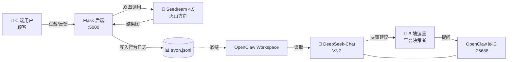

# 甲趣 · AI 美甲试戴 + 智能运营

> 用 AI 让用户"先试再做"，用 AI 帮平台"决策推什么"。

美甲行业的 **"美团点评 + AI 试戴"** 平台 Demo——双 AI 大模型驱动，C 端用户行为反向闭环到 B 端运营决策。

## 这是什么

**甲趣（JiaQu）** 不是一个单纯的"美甲试戴工具"，也不是一个单纯的"美甲电商"。它是一个把这两件事用 AI 闭环连起来的平台：

1. **C 端 AI 试戴**——用户上传手部照片 + 从 25 个预设款式中选一个（或自己上传任意美甲灵感图），15-25 秒内得到 AI 生成的真实试戴效果
2. **B 端智能运营**——平台运营人员通过 OpenClaw 网关与 DeepSeek 对话，AI 实时读取 C 端用户行为日志，给出"哪个款式该推首页 / 哪家店该流量加权 / 哪些刷量门店要打压"的决策建议

C 端积累数据，B 端用 AI 反向决策——**形成"用户行为 → 数据沉淀 → AI 分析 → 运营决策 → 流量分发 → 用户行为"的闭环**。

## 架构



## 核心创新

| 别人在做的 | 我们在做的 |
|---|---|
| 美甲试戴 App | C 端 + B 端 **双 AI 闭环** |
| 美团选店预约 | 试戴行为 **反向驱动** 门店流量分配 |
| 后台数据看板 | 用大模型 Chat **实时对话**给决策 |

### 🎯 杀手级 Demo

> 评委打开手机做一次试戴 → 30 秒后，运营在 OpenClaw 控制台问"分析刚刚那个用户的偏好" → DeepSeek 立刻读 jsonl 给出分析报告 + 推荐策略。

实时数据飞轮，让评委亲眼看见 AI 决策不是 demo 假数据，而是真实的用户行为。

## 技术栈

| 层 | 技术 |
|---|---|
| 前端 | 单页应用 (Tailwind CDN + Vanilla JS)，移动端优先，粉色玫瑰金主题 |
| 后端 | Python 3.12 + Flask 3.0 |
| AI 试戴 | 火山引擎方舟 / Seedream 4.5 (`doubao-seedream-4-5-251128`) |
| 运营脑 | OpenClaw 2026.4.21 + DeepSeek-Chat (V3.2, 128K ctx) |
| 部署 | Tencent Cloud Lighthouse Shanghai · Ubuntu 24 · 4 核 4G 3M |

## 项目结构

```
.
├── app.py              # Flask 后端：试戴 / 反馈 / 门店 API
├── static/
│   ├── index.html      # 移动端试戴 UI
│   ├── nails/          # 25 张预设美甲款式（nail_01.png ~ nail_25.png）
│   └── results/        # AI 生成结果（运行时产物，不进 git）
├── data/               # tryon.jsonl 行为日志（不进 git）
├── deploy.sh           # 服务器一键部署脚本
├── requirements.txt
├── .env.example        # 环境变量模板
└── README.md
```

## API

| 路由 | 方法 | 说明 |
|---|---|---|
| `/` | GET | 首页（试戴 UI） |
| `/health` | GET | 健康检查 |
| `/api/styles` | GET | 列出 25 个预设款式 |
| `/api/shops` | GET | 列出附近门店（mock 数据） |
| `/api/tryon` | POST | 执行 AI 试戴 |
| `/api/feedback` | POST | 收用户反馈：喜欢 / 不喜欢 / 预约 |

试戴请求体示例：
```json
{
  "user_id": "u_axquge8j",
  "hand_image": "data:image/jpeg;base64,...",
  "style_id": "nail_05"
}
```

或使用自定义款式：
```json
{
  "user_id": "u_axquge8j",
  "hand_image": "data:image/jpeg;base64,...",
  "custom_style_image": "data:image/jpeg;base64,..."
}
```

## 行为日志（OpenClaw 数据源）

`data/tryon.jsonl` 中每行一个 JSON 事件：

```jsonl
{"ts":"2026-05-07T14:22:05Z","event":"tryon_start","request_id":"abc123","user_id":"u_axx","style_id":"nail_05","style_kind":"preset"}
{"ts":"2026-05-07T14:22:30Z","event":"tryon_success","request_id":"abc123","latency_ms":15234,"result_url":"/static/results/abc123.png"}
{"ts":"2026-05-07T14:22:45Z","event":"feedback","request_id":"abc123","action":"like"}
{"ts":"2026-05-07T14:22:50Z","event":"feedback","request_id":"abc123","action":"book","shop_id":"shop_002"}
```

通过软链 `/root/.openclaw/workspace/tryon-data → /opt/jiaqu/data` 让 DeepSeek 能直接读取。

## 本地开发

```bash
git clone https://github.com/vertex-2026-code/vertex.git jiaqu
cd jiaqu

python3 -m venv venv
source venv/bin/activate
pip install -r requirements.txt

cp .env.example .env
# 编辑 .env，填入真实的 ARK_API_KEY

source .env
python app.py
```

访问 http://localhost:5000

## 服务器部署

**首次部署**：
```bash
git clone https://github.com/vertex-2026-code/vertex.git /opt/jiaqu
cd /opt/jiaqu
python3 -m venv venv && source venv/bin/activate
pip install -r requirements.txt
cp .env.example .env && vim .env
./deploy.sh
```

**后续迭代**（一行搞定）：
```bash
git pull && ./deploy.sh
```

## OpenClaw 接入运营脑

```bash
# 让 DeepSeek 能读取试戴日志（一次性）
ln -s /opt/jiaqu/data /root/.openclaw/workspace/tryon-data
```

然后在 OpenClaw 控制台直接对话：

> "读 `/workspace/tryon-data/tryon.jsonl`，统计今天每个款式的试戴次数和喜欢率，给出该上首页的 top 3 款式。"

> "找出过去 24 小时试戴次数高但预约转化低的款式，分析原因并给运营建议。"

> "对比 shop_001 和 shop_003 的预约数据，判断有没有刷量嫌疑。"

DeepSeek 会实时读取最新 jsonl 数据并给出**结构化的运营决策报告**。

## Roadmap

- [x] C 端 AI 试戴（Seedream 4.5）
- [x] 25 个预设款式 + 用户自定义款式上传
- [x] 客户端图片压缩（200KB 上传，30 倍提速）
- [x] B 端 OpenClaw + DeepSeek 接入
- [ ] OpenClaw 飞书 Bot 集成（运营人员手机直接问）
- [ ] 大模型升级到豆包 1.6（更懂中文美甲场景）
- [ ] 真门店数据库 + 预约工作流

## License

Hackathon project · MIT 0 · 自由 fork

